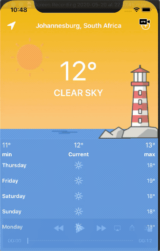

     

<h1 align="center">Weather iOS App</h1>

    
    
    

## Introduction
This iOS Weather allows you to access the weather in your location using the [OpenWeather](https://openweathermap.org/) API data. You're able to retrieve weather data from your current location, or choose a location from [Google Places](https://developers.google.com/places/ios-sdk/intro)

     

## Getting Started
- Pull this repo
- Run `bundle install`
- Run `bundle exec pod install`
- Open `Weather.xcworkspace`

## Development

### Architecture
I built my app on a VIPER architecture pattern - this is difficult to demonstrate when using one Module/View Controller, but I stuck to these main principles:
- Built most of the UI on the View Controller.
- Split out most of the heavy lifting/logic to the Presenter.
- Used the interactor for network requests/interaction with other services.
- Maintained protocols where possible to facilitate better mocking during testing.

### Services
In order to send API requests I wrote a simple APIService which is then inherited by the WeatherAPIService. While I usually use [Moya](https://github.com/Moya/Moya) in quick projects, building a simple API Service using `URLSession` can be just as easy as using a wrapper.

### Tests
I opted to use [Quick](https://github.com/Quick/Quick) to create test suites as I prefer the behaviour-driven testing aspect of it. 
The tests are divided into each class and test different contexts and outcomes. The test coverage is not as broad as it could be, and could be improved.

## Continuous Integration
I've integrated [Fastlane](https://github.com/fastlane/fastlane) into the project, and use GitHub Actions to run the tests.
Code Coverage is reported to [Codecov](https://codecov.io/)
